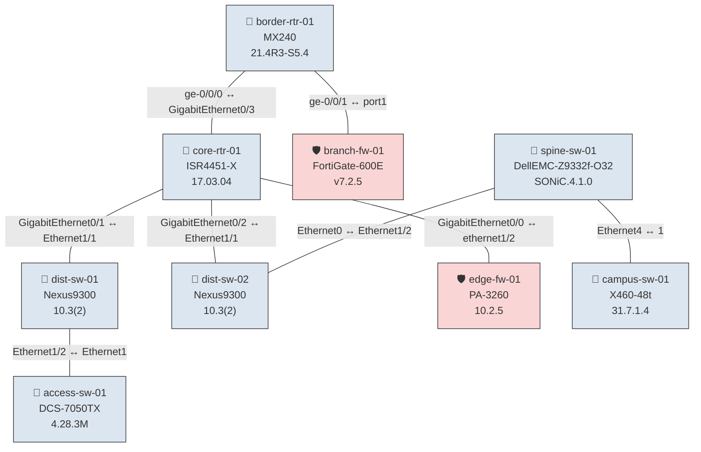

# NDG — Network Diagram / Topology Generator

A Python CLI tool that **SSHes into network devices** (routers, switches, firewalls), collects baseline facts and neighbor data, builds a unified topology graph, and renders **Graphviz** and **Mermaid** diagrams — all from the command line.

```
                    ┌──────────────┐
                    │  Inventory   │  (YAML)
                    │  YAML file   │
                    └──────┬───────┘
                           │
           ┌───────────────┼───────────────┐
           ▼               ▼               ▼
     ┌───────────┐  ┌────────────┐  ┌────────────┐
     │  Collect  │  │  Neighbors │  │   Diagram  │
     │  Facts    │  │  CDP/LLDP  │  │  Generator │
     └─────┬─────┘  └─────┬──────┘  └─────┬──────┘
           │              │               │
           ▼              ▼               ▼
     device_facts.json  neighbors.json  topology.dot / .mmd / .png
```

---

## Features

| Capability | Details |
|---|---|
| **Multi-vendor SSH** | Cisco IOS/IOS-XE, NX-OS, Arista EOS, Juniper JunOS, Fortinet FortiOS, Palo Alto PAN-OS, SONiC, Extreme EXOS via Netmiko |
| **Baseline collection** | Hostname, model, OS version, interface list |
| **Neighbor discovery** | CDP + LLDP detail parsing |
| **Topology building** | De-duplicated node/edge graph from raw neighbor data |
| **Graphviz output** | DOT source + rendered PNG / SVG / PDF |
| **Mermaid output** | `.mmd` file — paste into [mermaid.live](https://mermaid.live) or embed in Markdown |
| **Rich CLI tables** | Pretty-printed device facts & neighbors in the terminal |
| **Demo mode** | Full pipeline with sample data — no real devices needed |
| **JSON storage** | All intermediate data saved as structured JSON for further automation |

---

## Quick Start

### 1. Install

```bash
cd NDG
python -m venv .venv && source .venv/bin/activate
pip install -e .
```

> **Optional:** for PNG/SVG rendering, also install the Graphviz binary:
> ```bash
> sudo apt install graphviz   # Debian / Ubuntu
> brew install graphviz        # macOS
> ```

### 2. Demo (no devices needed)

```bash
ndg demo
```

This generates sample facts, neighbor data, topology JSON, Graphviz DOT, Mermaid diagrams, and (optionally) a PNG — all under `output/`.

### 3. Real Devices

```bash
# Copy and edit the inventory
cp inventory.example.yaml inventory.yaml
nano inventory.yaml

# Collect baseline facts
ndg collect -i inventory.yaml

# Query CDP/LLDP neighbors
ndg neighbors -i inventory.yaml

# Build topology and render diagrams
ndg diagram --format mermaid dot png

# View data in terminal tables
ndg show facts
ndg show neighbors
ndg show topology
```

---

## Inventory Format

```yaml
defaults:
  username: admin
  password: Cisco123!
  device_type: cisco_ios

devices:
  - host: 10.0.0.1
    hostname: core-rtr-01
  - host: 10.0.0.2
    device_type: cisco_nxos
    username: nxadmin
    password: NxPass!
  - host: 10.0.0.5
    device_type: paloalto_panos
```

Supported `device_type` values: `cisco_ios`, `cisco_xe`, `cisco_nxos`, `arista_eos`, `paloalto_panos`, `juniper_junos`, `juniper`, `fortinet`, `fortinet_ssh`, `sonic_ssh`, `extreme_exos`, `extreme`

---

## CLI Reference

```
ndg <command> [options]

Commands:
  collect      SSH into devices → collect hostname, model, OS, interfaces
  neighbors    SSH into devices → query CDP/LLDP neighbor tables
  diagram      Build topology graph → render Graphviz & Mermaid diagrams
  show         Display collected data in rich terminal tables
  demo         Run full pipeline with built-in sample data

Global options:
  -v           Verbose (INFO logging)
  -vv          Debug logging
  -V           Show version
```

### `ndg collect`
```
ndg collect -i inventory.yaml [-o output/device_facts.json]
```

### `ndg neighbors`
```
ndg neighbors -i inventory.yaml [-o output/neighbors.json]
```

### `ndg diagram`
```
ndg diagram [--facts FILE] [--neighbors FILE] [-o DIR] [-f mermaid dot png svg pdf]
```

### `ndg show`
```
ndg show facts|neighbors|topology [--facts FILE] [--neighbors FILE]
```

---

## Project Structure

```
NDG/
├── pyproject.toml              # Package metadata & dependencies
├── inventory.example.yaml      # Sample device inventory
├── README.md
├── ndg/
│   ├── __init__.py
│   ├── cli.py                  # CLI entry point (argparse + rich)
│   ├── connector.py            # SSH connection wrapper (Netmiko)
│   ├── collector.py            # Device fact & neighbor collection
│   ├── inventory.py            # YAML inventory loader
│   ├── platforms.py            # Platform registry (commands + parsers)
│   ├── topology.py             # Graph model (Node / Edge / Topology)
│   ├── diagram.py              # Graphviz DOT + Mermaid generators
│   ├── storage.py              # JSON save/load helpers
│   └── parsers/
│       ├── __init__.py
│       ├── cisco_ios.py        # IOS / IOS-XE parsers
│       ├── cisco_nxos.py       # NX-OS parsers
│       ├── arista_eos.py       # Arista EOS parsers
│       ├── paloalto_panos.py   # PAN-OS parsers
│       ├── juniper_junos.py    # Juniper JunOS parsers
│       ├── fortinet_fortios.py # FortiGate / FortiOS parsers
│       ├── sonic.py            # SONiC parsers
│       └── extreme_exos.py     # Extreme Networks EXOS parsers
└── output/                     # Generated files (git-ignored)
    ├── device_facts.json
    ├── neighbors.json
    ├── topology.json
    ├── topology.dot
    ├── topology.mmd
    └── topology.png
```

---

## Output Examples

### Mermaid Diagram (paste into [mermaid.live](https://mermaid.live))



### JSON (device_facts.json)

```json
[
  {
    "host": "10.0.0.1",
    "device_type": "cisco_ios",
    "hostname": "core-rtr-01",
    "model": "ISR4451-X",
    "os_version": "17.03.04",
    "interfaces": [
      {"name": "GigabitEthernet0/0", "ip_address": "10.0.0.1", "status": "up", "protocol": "up"}
    ]
  }
]
```

---

## Extending

- **Add a new vendor:** Create a parser in `ndg/parsers/`, then register it in `ndg/platforms.py`
- **Automation pipeline:** Import `ndg.collector` and `ndg.topology` as a library in your own scripts
- **CI/CD baseline:** Run `ndg collect` on a schedule, diff JSON output to detect network drift

---

## License

MIT
